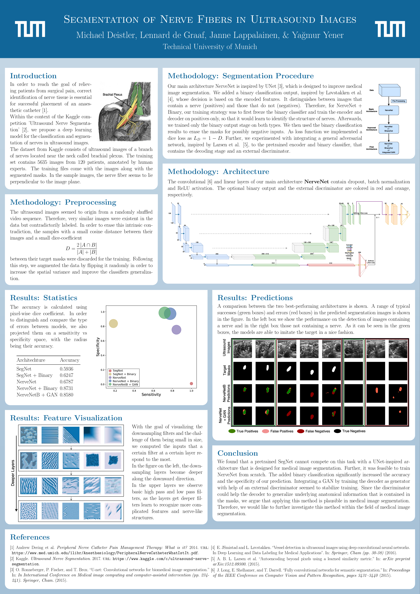

### Ultrasound Nerve Segmentation using CNNs

We implemented [U-Net](https://lmb.informatik.uni-freiburg.de/people/ronneber/u-net/ "U-Net")
 variants for nerve segmentation from ultrasonic images in the scope of a research project in
Deep Learning for Computer Vision @TU-Munich. The underlying data is freely available on 
[Kaggle](https://www.kaggle.com/c/ultrasound-nerve-segmentation "Ultrasound Nerve Segmentation"):  

"Even the bravest patient cringes at the mention of a surgical procedure. Surgery inevitably brings discomfort, and oftentimes involves significant post-surgical pain. Currently, patient pain is frequently managed through the use of narcotics that bring a bevy of unwanted side effects.
This competition's sponsor is working to improve pain management through the use of indwelling catheters that block or mitigate pain at the source. Pain management catheters reduce dependence on narcotics and speed up patient recovery.
Accurately identifying nerve structures in ultrasound images is a critical step in effectively inserting a patient’s pain management catheter. In this competition, Kagglers are challenged to build a model that can identify nerve structures in a dataset of ultrasound images of the neck. Doing so would improve catheter placement and contribute to a more pain free future."


#### Results



#### Installation

Simply clone the repository and add it to your virtual environment by

```
echo $PWD > ~/path/to/env/lib/python3.7/site-packages/nervenet.pth
```

The data should be located in a parent directory as follows
```
..\data
    \images
        1_1.tif
        ...
        9_99.tif
    \test
        1.tif
        ...
        999.tif
    image_files.txt
    text_files.txt
```

Note: we do not guarantee code consistency due to later cleanup without testing. Feel free to contact for support.


